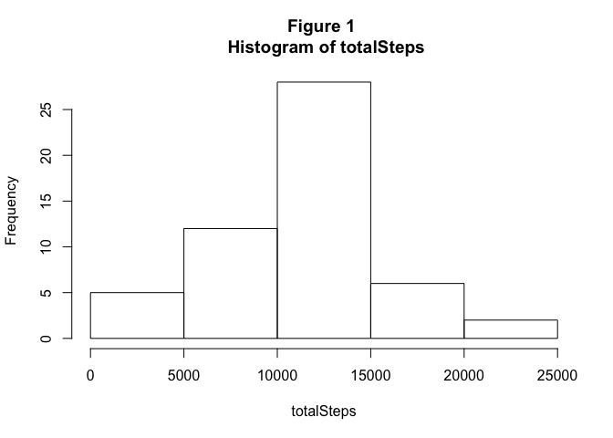

# Reproducible Research: Peer Assessment 1


## Loading and preprocessing the data

The data for this assignment is described in the assignment as follows…

> This assignment makes use of data from a personal activity monitoring device. This device collects data at 5 minute intervals through out the day. The data consists of two months of data from an anonymous individual collected during the months of October and November, 2012 and include the number of steps taken in 5 minute intervals each day. 

To read in the data a vector (v) is constructed for the variable names and then used with read.csv to load the data into the data frame *activityData*. No further processing of the data is required at the time it is read from the file.


```r
#
# Set the working directory
#
workDir <- getwd()
if (!is.null(workDir)) {setwd(workDir)} else {
    cat("Please set working directory before continuing.")
    break
}

v = c("activitySteps", "activityDate", "activityTime")
activityData = read.csv("activity.csv", col.names = v)
```

## What is mean total number of steps taken per day?

The total number of steps for each day is calculated and saved in the vector *totalSteps*. A histogram (Figure 1) of *totalSteps* is then produced. This is followed by a computation of the mean and median of totalSteps, having removed any values of NA.


```r
totalSteps <- by(activityData$activitySteps, activityData$activityDate, sum)
hist(totalSteps, main = "Figure 1 \n Histogram of totalSteps")
```

<!-- -->

```r
mean_totalSteps <- mean(totalSteps, na.rm = TRUE)
median_totalSteps <- median(totalSteps, na.rm = TRUE)
cat("   totalSteps mean = ", mean_totalSteps, "\n", 
    "totalSteps mediam = ", median_totalSteps)
```

```
##    totalSteps mean =  10766.19 
##  totalSteps mediam =  10765
```

## What is the average daily activity pattern?

Using the **by** function a list of the mean number of steps for each time interval is generated and assigned to *intervalMeans*. A time series plot is then produced of the mean number of steps for the time intervals. Finally, the time interval having the greatest mean number of steps is identified.


```r
intervalMeans <- by(activityData$activitySteps, activityData$activityTime, mean, na.rm = TRUE)
plot(names(intervalMeans), intervalMeans, type = "l", 
     main = "Figure 2 \n Mean Number of Steps for Each Time Interval",
     xlab = "Time Interval",
     ylab = "Mean Number of Steps")
```

<!-- -->

```r
cat("Time interval containing the greatest mean number of steps is", names(intervalMeans[which.max(intervalMeans)]), "\n")
```

```
## Time interval containing the greatest mean number of steps is 835
```

## Imputing missing values

The dataset is known to contain entries without "steps" data. The number of records without complete information is determined with the following code.


```r
numberNA <- sum(is.na(activityData$activitySteps))
cat("Number of records containing NA =", numberNA, "\n")
```

```
## Number of records containing NA = 2304
```

In deciding what to do with the NAs present in the data it would be helpful to know how they are distributed. The data points containing NA in the *activitySteps* was extracted using **subset** and then the number of dates represented in the subset was determined by determining the length of the result of **unique** based on *activityDate* as shown below.


```r
intervalsNA <- subset(activityData, is.na(activityData$activitySteps))
length(unique(intervalsNA$activityDate))
```

```
## [1] 8
```

```r
unique(intervalsNA$activityDate)
```

```
## [1] 2012-10-01 2012-10-08 2012-11-01 2012-11-04 2012-11-09 2012-11-10
## [7] 2012-11-14 2012-11-30
## 61 Levels: 2012-10-01 2012-10-02 2012-10-03 2012-10-04 ... 2012-11-30
```

As can be seen from the results all the NAs occurred on eight separate dates and visual inspection of the data reveals that there isn't any *activitySteps* data for any of the time intervals on those dates. It would be reasonable to assume that the subject forgot to put on the device or elected not to wear it those days. An alternative explanation is that the subject was incapacitated that day (sick or injured) and did not walk. 

If the reason was either of the first two, it would be reasonable to replace the NAs with the mean *activitySteps* values for each time interval. It should be noted that this approach might result in a skewing of the data and should be investigated further. The data replacement is accomplished with the following code.

Rather than using the mean itself, a rounded value of the mean would be used to replace the NAs. This decision was based on the understanding that the *activitySteps* values are discrete and fractional steps data cannot be collected by the device so imputed values should have this same restriction.


```r
activityDataCleaned <- activityData
for (i in which(is.na(activityDataCleaned$activitySteps))) {
    activityDataCleaned$activitySteps[i] <- 
        round(intervalMeans[[as.character(activityDataCleaned$activityTime[i])]])
}
cat("Number of records containing NAs", sum(is.na(activityDataCleaned$activitySteps)))
```

```
## Number of records containing NAs 0
```

Having now replaced the NAs with the mean of the number of steps (rounded to a whole number since the original data did not contain fractional entries) in that time interval it would be appropriate to see how the replacement affects the dataset as a whole. To do this 


```r
cleanedTotalSteps <- by(activityDataCleaned$activitySteps, 
                        activityDataCleaned$activityDate, sum)
hist(cleanedTotalSteps, main = "Figure 3 \n Histogram of cleanedTotalSteps")
```

<!-- -->

```r
mean_cleanedTotalSteps <- mean(cleanedTotalSteps, na.rm = TRUE)
median_cleanedTotalSteps <- median(cleanedTotalSteps, na.rm = TRUE)
cat("   cleanedTotalSteps mean = ", mean_cleanedTotalSteps, "\n", 
    "cleanedTotalSteps mediam = ", median_cleanedTotalSteps)
```

```
##    cleanedTotalSteps mean =  10765.64 
##  cleanedTotalSteps mediam =  10762
```

The imputation of the rounded means for the missing steps data affected both the mean and median of the total steps. The resulting changes are less than 0.01%, which seems an acceptable difference.

## Are there differences in activity patterns between weekdays and weekends?

In order to address this question a new variable that categorizes each observation as occurring on a weekday or weekend must be introduced. The following code uses the function **weekdays** to identify the day of the week for each value of *activityTime* and introduce a new variable *activityWDWE*.


```r
for (i in 1:length(activityDataCleaned$activityDate)) {
    if (weekdays(as.Date(activityDataCleaned$activityDate[i])) == "Sunday" |
        weekdays(as.Date(activityDataCleaned$activityDate[i])) == "Saturday") { 
        activityDataCleaned$activityWDWE[i] <- "weekend" 
    }
    else activityDataCleaned$activityWDWE[i] <- "weekday"
}

table(activityDataCleaned$activityWDWE)
```

```
## 
## weekday weekend 
##   12960    4608
```

The last requirement of the assignment is to generate a panel plot of a time-series of the average steps in each time interval distinguishing between weekend and weekday data. The **dplyr** package will be used to produce the data frame (*newData*) required for the plats and the **ggplot2** package will be used to generate the graphs. The following code produces the required output.


```r
#
# Install the required libraries if necessary
#
pkgs <- installed.packages()
if (!("dplyr" %in% pkgs[, 1])) install.packages("dplyr")
library(dplyr)

if (!("ggplot2" %in% pkgs[, 1])) install.packages("ggplot2")
library(ggplot2)

if (!("grid" %in% pkgs[, 1])) install.packages("grid")
library(grid)
```

```r
# use dplyr functions group_by and summarise to generate a dataset of the mean steps
# by weekday-weekend and time

 newData <- activityDataCleaned %>%
     group_by(activityWDWE, activityTime) %>%
     summarise(stepsMean = mean(activitySteps))
#
#  Build the plot
#

g <- qplot(activityTime, stepsMean, data = newData, facets = . ~ activityWDWE, geom = "line")
g <- g + labs(title = "Figure 4 \nMean Steps Per Time Interval, Weekdays vs Weekends")
g <- g + labs(x = "Time Interval", y = "Mean Steps")
g <- g + facet_wrap(~activityWDWE, nrow = 2)
g <- g + theme(panel.margin = unit(1, "lines"))

g
```

<!-- -->
